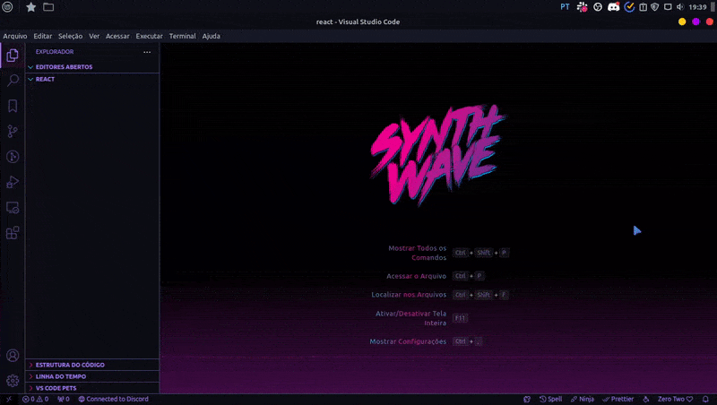
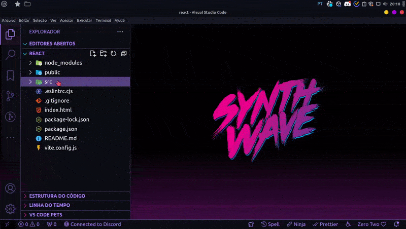
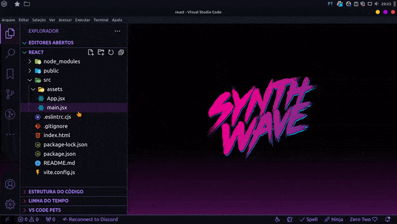

# Aula 01 - Introdução e instalação do React

## Introdução

O React é um framework do JavaScript que foi construído com base no conceito de Single Application, ou seja, invés
de trabalhar com vários arquivos HTML o React só trabalha somente com o index.html, enquanto todo o resto das
páginas e seus elementos vão ser renderizados pelo React através de arquivos com a extensão `.jsx`.

O jsx é a fusão de JavaScript e HTML já que é possível escrever elementos HTML dentro do arquivo.

Sua syntax é a seguinte:

```jsx
// NomeDaFunção () => {
//   JavaScript
//   const nomeDaConstante = lógica;
//   return (
//     HTML
//     <div>
//       <p></p>
//     </div>
//   );
// };
```

Nas próximas aulas iremos nos aprofundar mais nos conceitos do React como componentização, props, estados, rotas e
muito mais.

## Instalação e utilização

Para utilizar o React você primeiro precisa instalar o node.js, recomendamos que instale a versão mais recente da
LTS.

Com o node instalado abra o VS Code na pasta do seu projeto e abra o terminal:

Windows: Ctrl + Shift + "

Linux: Ctrl + Shift + ´

Em seguida com o terminal aberto digite o seguinte comando:

cmd ou powershell: npm create vite@latest . -- --template react '&' npm install

bash, zsh ou derivados: npm create vite@latest . -- --template react && npm install



Com o React instalado antes de começar a utiliza-lo remova os arquivos assets/react.svg App.css e index.css:



Agora abra o arquivo main e delete o import do index.css, em seguida abra o arquivo App.jsx e delete tudo que
tem dentro:



Agora dentro do App.jsx é onde toda a sua aplicação irar ser renderizada e há várias maneiras de declarar funções 
no React e eu irei mostrar 3 formas:

#### Primeira Forma

```jsx
export default () => {
  return (
    <>
      // Conteúdo
    </>
  );
};
```

#### Segunda Forma

```jsx
const App = () => {
  return (
    <>
      // Conteúdo
    </>
  );
};

export default App;
```

#### Terceira Forma

```jsx
export const App = () => {
  return (
    <>
      // Conteúdo
    </>
  );
};
```

Feito isto a sua aplicação React está pronta para o desenvolvimento.

Na próxima aula iremos ver como a componentização funciona, eu espero vocês lá!