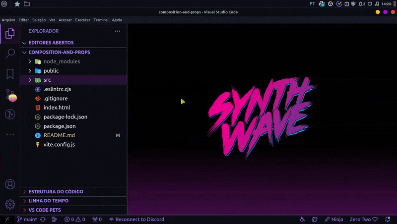

# Aula 02 - Componentes

## Introdução

Como dito anteriormente o umas das vantagens do React é a componentização, que é separar os elementos de suas páginas em componentes, ou seja, separar em pequenos blocos de códigos, isso facilita na organização e legibilidade do seu código.

Mas quando eu devo criar componentes?

Bem, geralmente temos duas situações que podemos utilizar como critério na criação de componentes: quando algo é único (header, footer, section e etc) ou que se repete.

Agora segue um exemplo de algo único e que se repete:

### Exemplo - NamesList

Neste exemplo criaremos dentro da pasta src uma pasta chamada components, nela conterá todos os componentes de nossa aplicação.



Ainda na src criaremos uma pasta chamada data, nela criaremos um arquivo chamado names.js.


Que conterá o seguinte código:

```js
export const names = [
  {
    id: 1,
    name: "Lucas",
  },
  {
    id: 2,
    name: "Thiago",
  },
  {
    id: 3,
    name: "Elias",
  },
  {
    id: 4,
    name: "Gabriel",
  },
];
```

Com isso feito, criaremos dentro da pasta components uma pasta chamada NamesList (que é o nome do nosso componente, lembrando que nome de componente sempre começa com letra __maiúscula!__), em seguida dentro de NamesList criaremos o nosso arquivo index.jsx:


e dentro dele conterá o seguinte código:

```jsx
import { names } from "../../data/names";

export default () => {
  return (
    <section>
      <ul>{}</ul>
    </section>
  );
};
```

Em seguida criaremos um map para efetuar a renderização de nossa lista de nomes:

```jsx
import { names } from "../../data/names";

export default () => {
  return (
    <section>
      <ul>{names.map(nome => )}</ul>
    </section>
  );
};
```

Existem 2 formas de se fazer a renderização: de forma direta ou por componente.

#### Primeira forma: direta

```jsx
import { names } from "../../data/names";

export default () => {
  return (
    <section>
      <ul>
        {names.map((nome) => (
          <li key={nome.id}>
            <h3>{nome.name}</h3>
          </li>
        ))}
      </ul>
    </section>
  );
};
```

Na primeira forma renderizamos a lista de nomes de forma direta aplicando os campos de "id" na tag `<li>` dentro da propriedade `key={}` ( a key é uma propriedade do React que funciona como uma identificação única, ou seja, um `id`. Isto garante que o React seja capaz de identificar cada objeto renderizado na aplicação de maneira única ) e a "name" na tag `<h3>`.

#### Segunda forma: componente

Na segunda forma iremos criar uma nova pasta para o novo componente que será chamado de NameCard ele será criado dentro do componente NamesList, dentro do componente NameCard criaremos um index.jsx:


Que conterá o seguinte código:

```jsx
export default () => {
  return (
    <li>
      <h3></h3>
    </li>
  );
};
```

Como a lista de objetos names só contém campos de "id" e "name" iremos desconstruir o objeto no parâmetro da função e aplicaremos o campo "name" na tag `<h3>` conforme o código a seguir:

```jsx
export default ({ nome: { name } }) => {
  return (
    <li>
      <h3>{name}</h3>
    </li>
  );
};
```

Tendo feito isso, voltaremos no componente NamesList e importaremos o componente NameCard onde o colocaremos no retorno do map, também passaremos a propriedade `key={}` e passaremos próprio objeto como uma propriedade para que o componente NameCard possa receber o objeto, conforme o código a seguir:

```jsx
import { names } from "../../data/names";
import NameCard from "./NameCard";

export default () => {
  return (
    <section>
      <ul>
        {names.map((nome) => (
          <NameCard key={nome.id} nome={nome} />
        ))}
      </ul>
    </section>
  );
};
```

Após isso, podemos importar o componente NamesList dentro do App.jsx, conforme o código a seguir:

```jsx
import NamesList from "./components/NamesList";

export default () => {
  return (
    <>
      <NamesList />
    </>
  );
};
```
Agora podemos executar o comando `npm run dev` no terminal para ver o resultado:


Como pudermos ver a lista foi renderizada com sucesso!

Na próxima aula iremos falar sobre props no React, eu espero vocês lá!